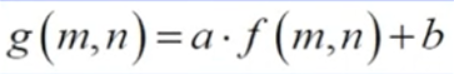
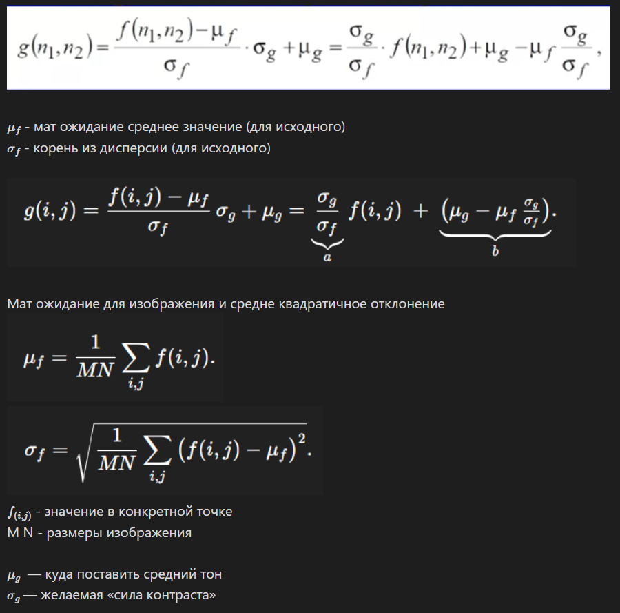

## 1. Гистограмма нормированная и не нормированная, размерность и размер массива гистограммы.

## 2. Линейное контрастирование, пороговая обработка: формула, график функции поэлементного преобразования по гистограмме, изменение гистограммы после линейного контрастирования

m,n - координаты

Растягиваем диапазон яркости на все значения от 0 до 255.  
a - расширяет и сжимает диапазон 
b -  просто смещение 

Чтобы растянуть диапазон яркости к 0 и 255 мы находим f(min) и f(max) и от них уже подбираем значение. 

 решаем вот такую систему уравнений и получаем наши значения 0 и 255:
 f min * a +b = 0 
 f max * a + b = 255

 $$ a =  \frac {255}{max - min} $$

 $$ b = 255 - fmax*a $$

 Или же универсальная формула, если мы хотим вручную задать  $gmin$  и $gmax$, то есть до каких диапазонов мы хотим растянуть яркость. 
fmin * a +b = gmin 
fmax * a + b = gmax 
$$ a =  \frac {g_{max} - g_{min}}{f_{max} - f_{min}} $$
$$ b =  \frac {g_{min} * f_{max} - g_{max} f_{min} }{f_{max} - f_{min}} $$

## 3. Выбор параметров лин контрастирования исходя из среднего/дисперсии. 

## 4. Возможные искажения яркости при использовании квантиля. 

## 5 гистограмма и интегральная функция распределения, их взаимосвязь через интеграл и через сумму, формула кумулятивной суммы

## 6. Эквализация: формула, гистограмма и интегральная функция распределения до/после.
В лекции было толкьо это на сколько я понмю: 
Выравнивание гистограммы
Делаем яркости +-  равновероятными
