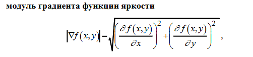
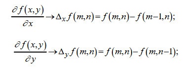
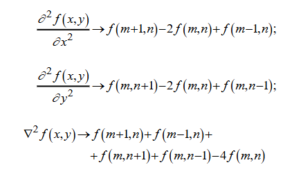

Первая производная:

Вторая производная:

Градиентные методы (Простой градиент, Прюитт):
- Дают положительные значения на границах
- Нулевые значения в однородных областях
- Можно применить пороговую обработку

Лапласиан:
- Дает положительные значения на одной стороне границы
- Дает отрицательные значения на другой стороне границы
- Нулевые значения точно на границе
- Нужно искать переходы через ноль